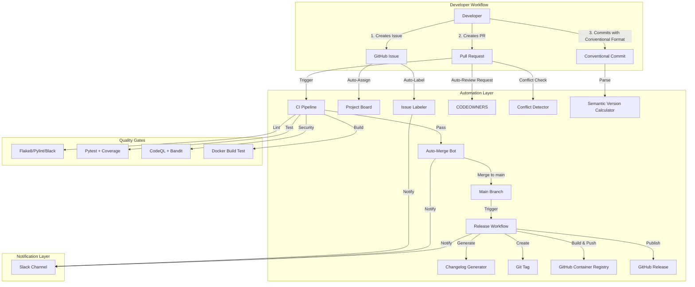
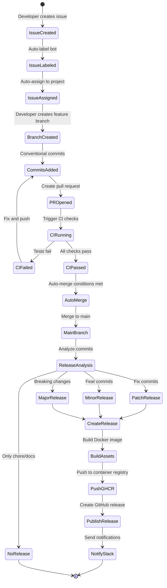
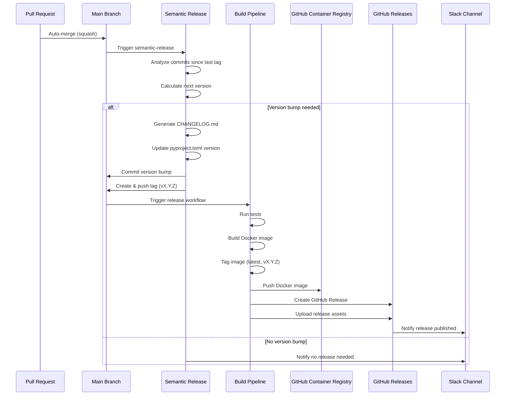

# GitHub Automation Architecture Plan

## Executive Summary

This document outlines a production-grade GitHub automation framework for the MCP Kali Server project. The architecture is designed for a solo developer workflow with **GitHub Flow** branching strategy, focusing on three key priorities:

1. **PR Automation with Auto-Merge** - Intelligent pull request workflows with automated reviews and merging
2. **Automated Semantic Releases** - Fully automated versioning, changelog generation, and releases
3. **Issue Labeling and Triage** - Automatic categorization and routing of issues

**Key Integrations:**

- Slack notifications for workflow events
- GitHub Container Registry (GHCR) for Docker image distribution
- Conventional Commits for structured commit messages
- Branch protection with quality gates

---

## Table of Contents

1. [Current State Analysis](#current-state-analysis)
2. [Architecture Overview](#architecture-overview)
3. [Component Design](#component-design)
4. [Workflow Specifications](#workflow-specifications)
5. [Integration Strategy](#integration-strategy)
6. [Security & Compliance](#security--compliance)
7. [Implementation Roadmap](#implementation-roadmap)
8. [Operational Procedures](#operational-procedures)

---

## Current State Analysis

### Existing Infrastructure

**Strengths:**

- ✅ Solid CI/CD foundation with lint, test, security scanning
- ✅ CodeQL security analysis (scheduled weekly)
- ✅ Branch protection documentation in place
- ✅ Docker support with multi-stage builds
- ✅ Basic release workflow (tag-triggered)
- ✅ Comprehensive documentation (CONTRIBUTING.md, SECURITY.md)
- ✅ Conventional changelog structure

**Gaps Identified:**

- ❌ No automated issue labeling or triage
- ❌ No PR automation (manual reviewer assignment, no auto-merge)
- ❌ Manual release process (no semantic versioning automation)
- ❌ No changelog automation from commits
- ❌ No container registry integration
- ❌ No notification system
- ❌ No automated dependency updates beyond security
- ❌ No PR conflict detection or stale PR management
- ❌ No metrics/analytics dashboard

### Gap Analysis Matrix

| Capability | Current State | Target State | Priority |
|------------|---------------|--------------|----------|
| Issue Triage | Manual | Auto-labeled by type/area | HIGH |
| PR Reviews | Manual assignment | Auto-assigned, auto-merge on success | CRITICAL |
| Versioning | Manual in pyproject.toml | Semantic-release automated | CRITICAL |
| Changelog | Manual updates | Auto-generated from commits | HIGH |
| Releases | Semi-automated | Fully automated on merge | CRITICAL |
| Container Deploy | Manual to GitHub Releases | Auto-push to GHCR | HIGH |
| Notifications | None | Slack integration | MEDIUM |
| Quality Gates | Basic (lint/test) | Comprehensive with auto-fix | HIGH |
| Dependency Updates | Security alerts only | Automated PRs with auto-merge | MEDIUM |

---

## Architecture Overview

### System Architecture Diagram



### Workflow State Machine



---

## Component Design

### 1. Automated Issue Triage System

**Objective:** Automatically categorize, label, and route issues based on content analysis.

**Components:**

#### 1.1 Issue Labeler

- **Trigger:** `issues: [opened, edited]`
- **Logic:**
  - Content analysis using keywords and patterns
  - Auto-apply labels: `bug`, `enhancement`, `security`, `documentation`, `question`
  - Area labels: `area/ci-cd`, `area/docker`, `area/security`, `area/api`
  - Priority labels: `priority/critical`, `priority/high`, `priority/medium`, `priority/low`

**Label Strategy:**

```yaml
Labels:
  Type:
    - bug: Keywords ["error", "crash", "exception", "fail"]
    - enhancement: Keywords ["feature", "add", "improve", "enhancement"]
    - security: Keywords ["security", "vulnerability", "CVE", "exploit"]
    - documentation: Keywords ["docs", "readme", "guide", "documentation"]
    - question: Keywords ["how to", "question", "help", "?"]
  
  Area:
    - area/ci-cd: File patterns [".github/workflows/*", "pyproject.toml"]
    - area/docker: File patterns ["Dockerfile", "docker-compose.yml"]
    - area/security: Keywords ["authentication", "authorization", "encryption"]
    - area/api: File patterns ["kali_server.py", "mcp_server.py"]
  
  Priority:
    - priority/critical: Keywords ["production down", "data loss", "security breach"]
    - priority/high: Keywords ["blocking", "urgent", "important"]
    - priority/medium: Default for enhancements
    - priority/low: Keywords ["nice to have", "low priority"]
```

#### 1.2 Issue Templates

Create structured templates for common issue types:

- **Bug Report Template**
- **Feature Request Template**
- **Security Vulnerability Template**
- **Documentation Request Template**

#### 1.3 Stale Issue Management

- Auto-label issues with no activity for 30 days as `stale`
- Auto-close stale issues after 14 additional days
- Exclude issues with `pinned`, `security`, or `long-term` labels

---

### 2. PR Automation Workflow

**Objective:** Streamline pull request lifecycle from creation to merge with minimal manual intervention.

**Components:**

#### 2.1 Auto-Reviewer Assignment

- **Trigger:** `pull_request: [opened, ready_for_review]`
- **Logic:**
  - Use CODEOWNERS file for automatic reviewer assignment
  - For solo developer: Skip reviewer requirement OR use GitHub Actions bot as reviewer
  - Auto-request review from bot that validates PR criteria

**CODEOWNERS Structure:**

```
# Global owners (solo developer setup)
* @canstralian

# Specific area ownership
/.github/ @canstralian
/docs/ @canstralian
*.py @canstralian
Dockerfile @canstralian
```

#### 2.2 PR Quality Checks

Automated checks before merge eligibility:

1. **Conventional Commit Validation**
   - Validate PR title follows conventional commit format
   - Types: `feat`, `fix`, `docs`, `style`, `refactor`, `test`, `chore`, `security`
   - Auto-suggest corrections if format is invalid

2. **PR Size Analysis**
   - Flag PRs with >500 lines changed as `size/XL`
   - Recommend splitting large PRs

3. **Conflict Detection**
   - Auto-comment when PR has merge conflicts
   - Provide resolution guidance

4. **Required Status Checks**
   - All CI jobs must pass
   - Code coverage must not decrease
   - Security scans must pass
   - Docker build must succeed

#### 2.3 Auto-Merge Conditions

**Merge Criteria (ALL must be met):**

```yaml
Auto-Merge Enabled When:
  - PR author is repository owner (@canstralian)
  - All required status checks pass
  - No merge conflicts
  - PR is not in draft mode
  - Branch is up-to-date with base branch
  - No review requested changes (if reviews enabled)
  - Has label: "automerge" (optional safety flag)
```

**Merge Strategy:**

- **Method:** Squash merge (maintains clean commit history)
- **Commit Message:** Use PR title (must be conventional commit format)
- **Branch Cleanup:** Auto-delete feature branch after merge

#### 2.4 PR Labeling

Auto-apply labels based on PR characteristics:

- `type/*` from PR title (feat, fix, etc.)
- `size/*` based on lines changed (XS, S, M, L, XL)
- `status/needs-review`, `status/approved`, `status/changes-requested`
- `automerge` when conditions are met

---

### 3. Semantic Versioning & Automated Releases

**Objective:** Fully automated release pipeline using conventional commits for version calculation.

**Tool Choice:** `semantic-release` (Node.js) or `python-semantic-release`

**Recommendation:** Use `python-semantic-release` for Python ecosystem alignment

#### 3.1 Semantic Release Configuration

**Version Calculation Rules:**

```yaml
Commit Type → Version Bump:
  - feat: → MINOR version bump (0.X.0)
  - fix: → PATCH version bump (0.0.X)
  - BREAKING CHANGE: → MAJOR version bump (X.0.0)
  - docs, style, refactor, test, chore: → No release
  - security: → PATCH version bump with security note
```

**Release Triggers:**

- **Primary:** Every merge to `main` branch
- **Analysis:** Scan commits since last tag
- **Decision:** Create release if version-bumping commits exist

#### 3.2 Changelog Generation

**Auto-Generated Sections:**

```markdown
## [X.Y.Z] - YYYY-MM-DD

### 🚀 Features
- feat commits listed here with PR links

### 🐛 Bug Fixes
- fix commits listed here with PR links

### 🔒 Security
- security commits listed here

### 📝 Documentation
- docs commits listed here

### 🔧 Maintenance
- refactor, chore commits listed here

### ⚠️ BREAKING CHANGES
- Listed prominently at top if present
```

**Format:** Keep a Changelog compatible
**Linking:** Auto-link to commits, PRs, and issues

#### 3.3 Release Workflow



#### 3.4 Release Assets

**Automatically Build & Attach:**

1. Docker image tarball (`.tar.gz`)
2. Source code archive (auto by GitHub)
3. Checksums file (SHA256SUMS.txt)
4. CHANGELOG excerpt for this release

---

### 4. GitHub Container Registry Integration

**Objective:** Automated Docker image building and distribution via GHCR.

#### 4.1 GHCR Workflow

**Triggers:**

- Tag push (vX.Y.Z) → Production release
- Merge to main → Latest tag
- PR opened → PR-specific tag for testing

**Image Tags Strategy:**

```yaml
Tags:
  - latest                    # Latest release
  - vX.Y.Z                   # Specific version
  - vX.Y                     # Minor version track
  - vX                       # Major version track
  - sha-<git-sha>            # Commit-specific
  - pr-<number>              # PR testing (ephemeral)
```

#### 4.2 Image Metadata

**Labels (OCI standard):**

```dockerfile
LABEL org.opencontainers.image.title="MCP Kali Server"
LABEL org.opencontainers.image.description="AI-driven security testing MCP server"
LABEL org.opencontainers.image.version="${VERSION}"
LABEL org.opencontainers.image.source="https://github.com/canstralian/forked-u-MCP-Kali-Server"
LABEL org.opencontainers.image.licenses="MIT"
LABEL org.opencontainers.image.created="${BUILD_DATE}"
LABEL org.opencontainers.image.revision="${GIT_SHA}"
```

#### 4.3 Multi-Architecture Support (Future)

**Build for:**

- linux/amd64 (priority)
- linux/arm64 (for ARM servers)

Use Docker Buildx with QEMU emulation

---

### 5. Slack Notification Integration

**Objective:** Real-time notifications for critical workflow events.

#### 5.1 Notification Events

**High Priority (Always Notify):**

- 🚨 Security vulnerability detected (CodeQL findings)
- 🎉 New release published
- ❌ CI failure on main branch
- ⚠️ Auto-merge failed
- 🔐 Security-labeled issue created

**Medium Priority (Configurable):**

- ✅ PR auto-merged
- 🏷️ New issue created and labeled
- 📦 Docker image pushed to GHCR
- 🔄 Dependency update PR created

**Low Priority (Optional):**

- PR opened
- PR review requested
- Issue closed

#### 5.2 Slack Message Format

**Example Release Notification:**

```
🎉 *New Release Published: v0.2.0*

*Repository:* MCP Kali Server
*Version:* v0.2.0
*Type:* Minor Release

*Changes:*
• 3 new features
• 2 bug fixes
• 1 security improvement

*Docker Image:* 
`docker pull ghcr.io/canstralian/mcp-kali-server:v0.2.0`

<https://github.com/canstralian/forked-u-MCP-Kali-Server/releases/tag/v0.2.0|View Release Notes>
```

#### 5.3 Slack Webhook Configuration

**Secret Management:**

- Store webhook URL in GitHub Secrets: `SLACK_WEBHOOK_URL`
- Use separate webhooks for different channels (optional):
  - `SLACK_RELEASES_WEBHOOK` - Release announcements
  - `SLACK_SECURITY_WEBHOOK` - Security alerts
  - `SLACK_CI_WEBHOOK` - CI/CD status

---

## Workflow Specifications

### Workflow 1: Issue Labeler & Triage

**File:** `.github/workflows/issue-labeler.yml`

**Key Features:**

- Automatic label application based on issue content
- Project board auto-assignment
- Slack notification for security issues
- Issue template enforcement

**Dependencies:**

- `actions/github-script@v7` for custom logic
- `actions/labeler@v5` for pattern matching

---

### Workflow 2: PR Automation Suite

**File:** `.github/workflows/pr-automation.yml`

**Key Features:**

- Conventional commit title validation
- Auto-reviewer assignment via CODEOWNERS
- PR size labeling
- Conflict detection
- Auto-merge with quality gates

**Dependencies:**

- `peter-evans/enable-pull-request-automerge@v3`
- `actions/github-script@v7`
- Custom validation scripts

---

### Workflow 3: Semantic Release Pipeline

**File:** `.github/workflows/semantic-release.yml`

**Key Features:**

- Automated version calculation
- Changelog generation
- Tag creation
- Multi-stage release process

**Dependencies:**

- `python-semantic-release/python-semantic-release@v9`
- `actions/setup-python@v5`

---

### Workflow 4: Docker Build & Publish to GHCR

**File:** `.github/workflows/docker-publish.yml`

**Key Features:**

- Multi-tag strategy
- Image scanning for vulnerabilities
- GHCR push with proper authentication
- Image metadata and labels

**Dependencies:**

- `docker/setup-buildx-action@v3`
- `docker/login-action@v3`
- `docker/metadata-action@v5`
- `docker/build-push-action@v5`

---

### Workflow 5: Dependency Update Automation

**File:** `.github/workflows/dependency-updates.yml`

**Key Features:**

- Dependabot configuration for automated PRs
- Auto-merge for minor/patch updates
- Security update prioritization

**Configuration:**

- `.github/dependabot.yml`

---

### Workflow 6: Stale Issue & PR Management

**File:** `.github/workflows/stale.yml`

**Key Features:**

- Mark stale after 30 days of inactivity
- Close after 14 additional days
- Exemptions for labeled issues

**Dependencies:**

- `actions/stale@v9`

---

## Integration Strategy

### Authentication & Secrets

**Required GitHub Secrets:**

| Secret Name | Purpose | Scope |
|-------------|---------|-------|
| `GITHUB_TOKEN` | Default Actions token | Auto-provided by GitHub |
| `SLACK_WEBHOOK_URL` | Slack notifications | Repository secret |
| `GHCR_TOKEN` | GitHub Container Registry | Use `GITHUB_TOKEN` with appropriate permissions |

**GitHub Token Permissions:**

```yaml
permissions:
  contents: write        # For creating tags and releases
  packages: write        # For pushing to GHCR
  pull-requests: write   # For auto-merge and labels
  issues: write          # For issue labeling
  security-events: write # For CodeQL results
```

---

### Branch Protection Strategy

**Main Branch Protection Rules:**

```yaml
Branch: main
Rules:
  - Require pull request before merging: true
    - Required approvals: 0 (solo developer) or 1 (if adding collaborators)
    - Dismiss stale reviews: true
    - Require review from CODEOWNERS: false (solo setup)
  
  - Require status checks to pass: true
    Required checks:
      - Lint and Test (ci.yml)
      - Security Scanning (ci.yml)
      - CodeQL Analyze (codeql.yml)
      - Docker Build (ci.yml)
    - Require branches up to date: true
  
  - Require conversation resolution: true
  - Require signed commits: false (optional but recommended)
  - Require linear history: true (enforced by squash merge)
  
  - Include administrators: true
  - Allow force pushes: false
  - Allow deletions: false
```

---

### CODEOWNERS File

**File:** `.github/CODEOWNERS`

```
# Global ownership
* @canstralian

# Workflows and automation
/.github/ @canstralian

# Documentation
*.md @canstralian
/docs/ @canstralian

# Python code
*.py @canstralian

# Docker configuration
Dockerfile @canstralian
docker-compose.yml @canstralian

# Security-sensitive files
SECURITY.md @canstralian
.github/workflows/codeql.yml @canstralian
```

---

## Security & Compliance

### Secret Management

**Best Practices:**

1. Never commit secrets to repository
2. Use GitHub Secrets for sensitive values
3. Rotate secrets quarterly
4. Use least-privilege access for tokens
5. Audit secret usage regularly

**Secret Rotation Procedure:**

```bash
# 1. Generate new secret (e.g., Slack webhook)
# 2. Update GitHub repository secret
# 3. Test workflow with new secret
# 4. Revoke old secret
# 5. Document rotation in security log
```

---

### Compliance Tracking

**Automated Compliance Checks:**

- License validation (MIT)
- Security scanning (CodeQL, Bandit)
- Dependency vulnerability scanning
- Docker image CVE scanning
- SBOM (Software Bill of Materials) generation

**Audit Trail:**

- All automation actions logged via GitHub Actions
- Release history in CHANGELOG.md
- Git tags provide immutable version history

---

### Security Scanning Integration

**Multi-Layer Security:**

1. **Code Level:** CodeQL (SAST)
2. **Dependencies:** Dependabot + pip-audit
3. **Container:** Docker image scanning
4. **Runtime:** (Future) Runtime application security monitoring

---

## Implementation Roadmap

### Phase 1: Foundation (Week 1)

- [ ] Set up branch protection rules
- [ ] Create CODEOWNERS file
- [ ] Configure GitHub secrets (Slack webhook)
- [ ] Implement issue labeler workflow
- [ ] Implement PR automation basics

### Phase 2: Core Automation (Week 2)

- [ ] Implement semantic-release integration
- [ ] Set up auto-merge workflow
- [ ] Configure GHCR integration
- [ ] Implement Slack notifications
- [ ] Create dependency update automation

### Phase 3: Enhancement (Week 3)

- [ ] Implement stale issue management
- [ ] Add PR size analysis
- [ ] Enhance conflict detection
- [ ] Add multi-architecture Docker builds
- [ ] Create analytics dashboard

### Phase 4: Optimization (Week 4)

- [ ] Performance tuning of workflows
- [ ] Cost optimization (Actions minutes)
- [ ] Documentation refinement
- [ ] Create video tutorials
- [ ] Community feedback integration

---

## Operational Procedures

### Standard Operating Procedures

#### SOP 1: Creating a Feature

```bash
# 1. Create issue (auto-labeled)
# 2. Create feature branch
git checkout -b feat/amazing-feature

# 3. Make changes with conventional commits
git commit -m "feat: add amazing feature"

# 4. Push and create PR
git push origin feat/amazing-feature

# 5. PR auto-checks run
# 6. If all pass → auto-merge
# 7. Semantic release analyzes commit
# 8. New version released automatically
```

#### SOP 2: Hotfix Process

```bash
# 1. Create hotfix branch from main
git checkout -b fix/critical-bug main

# 2. Fix with conventional commit
git commit -m "fix: resolve critical security issue

BREAKING CHANGE: Changes authentication flow"

# 3. Push and create PR with priority/critical label
git push origin fix/critical-bug

# 4. Fast-track through CI (all checks must pass)
# 5. Auto-merge to main
# 6. Immediate release triggered (major version if breaking)
```

#### SOP 3: Release Rollback

```bash
# If release v0.5.0 is broken:

# 1. Immediately revert the release tag
git tag -d v0.5.0
git push origin :refs/tags/v0.5.0

# 2. Delete GitHub release (manual via UI or CLI)
gh release delete v0.5.0 --yes

# 3. Revert the problematic merge
git revert -m 1 <merge-commit-sha>
git push origin main

# 4. Create hotfix PR
# 5. New release will be v0.5.1 (patch)
```

#### SOP 4: Emergency Workflow Disable

```bash
# If automation is causing issues:

# 1. Navigate to repository settings
# 2. Actions → General → Disable specific workflow
# 3. Or disable all workflows temporarily
# 4. Fix the workflow file
# 5. Re-enable after testing
```

---

### Monitoring & Metrics

**Key Metrics to Track:**

| Metric | Target | Measurement |
|--------|--------|-------------|
| PR Merge Time | <24 hours | Time from PR open to merge |
| CI Success Rate | >95% | Percentage of passing CI runs |
| Release Frequency | Weekly | Number of releases per week |
| Auto-Merge Rate | >80% | Percentage of PRs auto-merged |
| Security Scan Failures | 0 | Count of security findings |
| Docker Build Time | <5 min | Duration of image builds |

**Dashboard Sources:**

- GitHub Insights (built-in)
- GitHub Actions analytics
- Custom Slack bot reports

---

### Troubleshooting Guide

#### Issue: Auto-merge not triggering

**Diagnostic Steps:**

1. Check if PR meets all merge criteria
2. Verify `automerge` label is applied
3. Check branch protection rules are configured
4. Review GitHub Actions logs for errors
5. Ensure GITHUB_TOKEN has correct permissions

**Solution:**

```yaml
# Ensure workflow has proper permissions
permissions:
  contents: write
  pull-requests: write
```

---

#### Issue: Semantic release not creating new version

**Diagnostic Steps:**

1. Verify commits follow conventional format
2. Check if commits are version-bumping types
3. Review semantic-release logs
4. Ensure last tag is properly set

**Solution:**

```bash
# Manually trigger semantic release
gh workflow run semantic-release.yml
```

---

#### Issue: GHCR push fails authentication

**Diagnostic Steps:**

1. Check GITHUB_TOKEN permissions
2. Verify repository has Packages write access
3. Check GHCR registry settings

**Solution:**

```yaml
# In workflow, ensure login step:
- name: Login to GHCR
  uses: docker/login-action@v3
  with:
    registry: ghcr.io
    username: ${{ github.actor }}
    password: ${{ secrets.GITHUB_TOKEN }}
```

---

## Cost Analysis

### GitHub Actions Usage

**Free Tier (Public Repositories):**

- Unlimited Actions minutes
- Unlimited storage

**Estimated Monthly Usage:**

- CI runs: ~200 runs × 5 min = 1,000 minutes
- Releases: ~4 releases × 10 min = 40 minutes
- Docker builds: ~30 builds × 8 min = 240 minutes
- **Total: ~1,280 minutes/month** (FREE for public repos)

---

## Conclusion

This architecture provides a comprehensive, production-grade GitHub automation framework tailored for solo developer workflows with potential for team scaling. The modular design allows incremental adoption while maintaining flexibility for future enhancements.

**Key Benefits:**

- 🚀 Faster development velocity (automated tedious tasks)
- 🔒 Enhanced security (multiple scanning layers)
- 📊 Better traceability (automated changelog and versioning)
- 🤖 Reduced manual errors (automation reduces human mistakes)
- 📈 Scalable foundation (easy to add team members later)

**Next Steps:**

1. Review and approve architecture
2. Implement Phase 1 foundation
3. Iterate based on real-world usage
4. Expand to additional integrations as needed

---

**Document Version:** 1.0  
**Last Updated:** 2025-11-08  
**Author:** Kilo Code (AI Architect)  
**Status:** Pending Review
